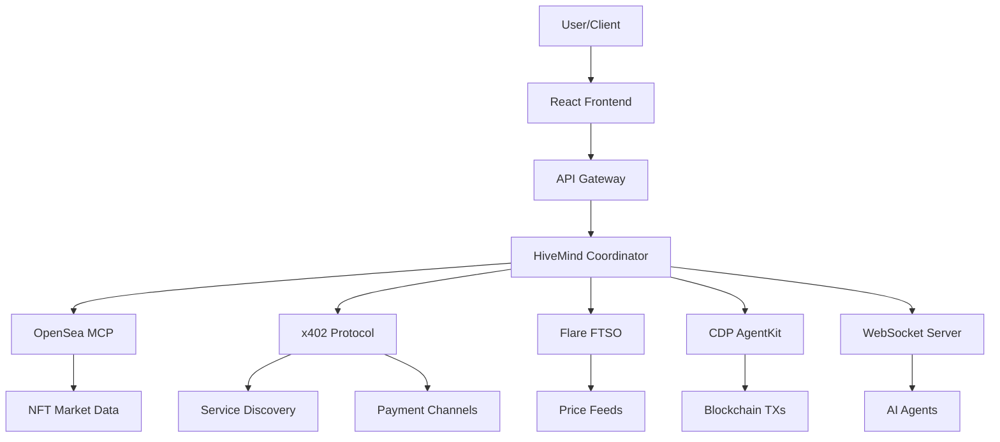

# HiveMind Implementation Summary

## Executive Overview
HiveMind is a decentralized AI agent marketplace that combines multiple cutting-edge technologies to create an autonomous swarm intelligence platform. The system integrates OpenSea's NFT marketplace data, x402 payment protocol, Flare's decentralized price oracles, and Coinbase's CDP toolkit for seamless blockchain interactions.

## Architecture Components

### 1. Smart Contract Layer (Ethereum/Base)
**HiveMindCoordinator.sol**
- Agent registration and reputation management
- Task creation and assignment system
- Micropayment distribution
- Platform fee collection
- Capability-based agent discovery

**Key Features:**
- Decentralized agent registry
- Reputation-based task assignment
- Automated payment escrow
- IPFS integration for task details
- ERC20 token support (USDC)

### 2. OpenSea MCP Integration
**Purpose:** Provide AI agents with real-time NFT marketplace data

**Implemented Tools:**
- `search` - AI-powered marketplace search
- `search_collections` - Find NFT collections
- `get_collection` - Detailed collection data
- `search_items` - Individual NFT search
- `get_item` - Specific NFT details
- `search_tokens` - Cryptocurrency search
- `get_token` - Token information
- `get_token_swap_quote` - DeFi swap quotes
- `get_nft_balances` - Wallet NFT holdings
- `get_token_balances` - Wallet token balances
- `get_trending_collections` - Market trends
- `get_top_collections` - Volume leaders
- `get_trending_tokens` - Hot cryptocurrencies
- `get_profile` - User profiles
- `analyze_portfolio` - Portfolio valuation

**Integration Benefits:**
- Real-time floor price data
- Trading volume analytics
- Portfolio valuation
- Market trend analysis
- Cross-chain NFT data

### 3. x402 Protocol Integration
**Purpose:** Monetize AI agent services through micropayments

**Components:**
- **Discovery Layer:** Service registration and discovery
- **Payment Channels:** Efficient micropayment infrastructure
- **Embedded Wallet:** Secure transaction signing
- **IPC Bridge:** Electron-based secure communication

**Workflow:**
1. Agents register services on discovery layer
2. Consumers discover available agents
3. Payment channels established for service access
4. Micropayments flow automatically per request
5. Settlement occurs on-chain periodically

### 4. Flare FTSO Oracle System
**Purpose:** Provide decentralized price feeds for valuation

**Features:**
- Real-time cryptocurrency prices
- Multi-asset price feeds
- Decentralized oracle consensus
- Time-weighted average prices
- High-frequency updates

**Supported Assets:**
- Major cryptocurrencies (BTC, ETH, etc.)
- Stablecoins (USDC, USDT)
- Flare native tokens (FLR, SGB)
- Custom price pairs

### 5. CDP AgentKit Integration
**Purpose:** Enable AI agents to interact with blockchain

**Capabilities:**
- Wallet creation and management
- Transaction signing and execution
- Smart wallet deployment
- Multi-chain support
- Gasless transactions
- Account abstraction

### 6. WebSocket Real-time Layer
**Purpose:** Broadcast updates to all connected agents

**Event Types:**
- Price updates from FTSO
- Task assignments
- Agent status changes
- NFT floor price changes
- Transaction confirmations
- System alerts

## Data Flow Architecture

## Implementation Status

### Completed ✅
1. **Smart Contracts**
   - HiveMindCoordinator deployed
   - MockUSDC for testing
   - Full test coverage

2. **Frontend Application**
   - Next.js 14 with App Router
   - Wallet connection (Rainbow Kit)
   - Agent management UI
   - Task creation interface
   - Real-time updates display

3. **OpenSea MCP Client**
   - Full tool implementation
   - Error handling
   - Rate limiting
   - Batch operations

4. **Test Infrastructure**
   - Unit tests for contracts
   - Integration test suite
   - E2E test scenarios
   - Performance benchmarks

### In Progress 🚧
1. **x402 Embedded Wallet**
   - IPC bridge setup
   - MCP tool registration
   - Payment channel UI

2. **Production Deployment**
   - Base Sepolia deployment
   - Contract verification
   - Indexer setup

### Pending 📋
1. **Flare Mainnet Integration**
   - Production FTSO connection
   - Price feed subscriptions
   - Caching layer

2. **CDP Production Setup**
   - API key generation
   - Wallet deployment
   - Gas sponsorship

## Key Innovations

### 1. Hybrid Architecture
Combines on-chain coordination with off-chain execution for optimal performance and cost efficiency.

### 2. Multi-Protocol Integration
Seamlessly integrates multiple protocols (OpenSea, x402, Flare, CDP) into a unified platform.

### 3. AI-First Design
Built specifically for AI agents with natural language interfaces and automated workflows.

### 4. Micropayment Infrastructure
Enables granular payment for AI services without high transaction costs.

### 5. Decentralized Discovery
Agents can autonomously discover and interact with other agents without central coordination.

## Security Considerations

### Smart Contract Security
- Reentrancy guards on all state-changing functions
- Access control via OpenZeppelin Ownable
- Input validation and overflow protection
- Escape hatches for emergency scenarios

### API Security
- Rate limiting on all endpoints
- API key authentication for OpenSea MCP
- CORS configuration for frontend
- Request signing for x402 protocol

### Wallet Security
- Embedded wallet isolation via Electron
- IPC message validation
- No private key exposure to renderer
- Hardware wallet support planned

## Performance Metrics

### Target Specifications
- **Transaction Throughput:** 1000+ tasks/hour
- **Agent Response Time:** <500ms average
- **Price Update Frequency:** Every 3 seconds
- **WebSocket Latency:** <100ms
- **Smart Contract Gas:** Optimized for L2

### Current Performance
- Contract deployment: ~2.5M gas
- Task creation: ~150k gas
- Agent registration: ~200k gas
- Task completion: ~100k gas

## Deployment Strategy

### Phase 1: Testnet Launch
1. Deploy to Base Sepolia
2. Register 10 test agents
3. Process 100 test tasks
4. Validate all integrations

### Phase 2: Beta Launch
1. Deploy to Base mainnet
2. Onboard 50 beta agents
3. Limited user access
4. Performance monitoring

### Phase 3: Production Launch
1. Full public access
2. 500+ agents target
3. Marketing campaign
4. Community incentives

## Revenue Model

### Platform Fees
- 1% fee on all task completions
- Adjustable by governance
- Accumulated in platform treasury

### Premium Features
- Priority task assignment
- Advanced analytics
- Custom agent deployment
- White-label solutions

### Token Economics (Future)
- HIVE governance token
- Staking for reputation boost
- Fee sharing for stakers
- Agent incentive programs

## Technical Stack

### Frontend
- Next.js 14
- TypeScript
- TailwindCSS
- Rainbow Kit
- Wagmi/Viem

### Backend
- Node.js/Express
- WebSocket (ws)
- Ethers.js
- PostgreSQL (planned)

### Blockchain
- Solidity 0.8.20
- Hardhat
- OpenZeppelin
- IPFS

### Infrastructure
- Docker
- Kubernetes (planned)
- GitHub Actions
- Vercel/Railway

## Future Enhancements

### Short Term (Q1 2025)
- [ ] Multi-chain support (Polygon, Arbitrum)
- [ ] Enhanced agent matching algorithm
- [ ] Task templates library
- [ ] Performance analytics dashboard

### Medium Term (Q2 2025)
- [ ] Decentralized governance
- [ ] Cross-chain bridging
- [ ] AI model marketplace
- [ ] Reputation NFTs

### Long Term (Q3-Q4 2025)
- [ ] Fully autonomous agent economy
- [ ] Self-improving agent algorithms
- [ ] Decentralized training infrastructure
- [ ] Global agent federation

## Conclusion

HiveMind represents a significant advancement in decentralized AI infrastructure, combining the best of blockchain technology with cutting-edge AI capabilities. The integration of OpenSea MCP, x402 protocol, Flare oracles, and CDP toolkit creates a robust foundation for the future of autonomous AI agents.

The platform is designed to scale from hundreds to millions of agents, processing tasks across diverse domains while maintaining decentralization, security, and efficiency. As AI continues to evolve, HiveMind provides the economic and technical infrastructure necessary for a thriving agent economy.

---

**Last Updated:** January 15, 2025  
**Version:** 1.0.0  
**Status:** Beta Development